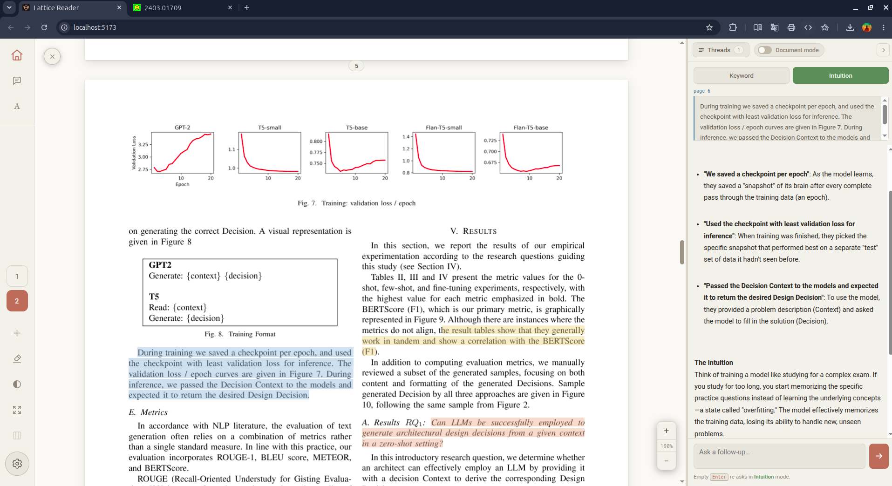
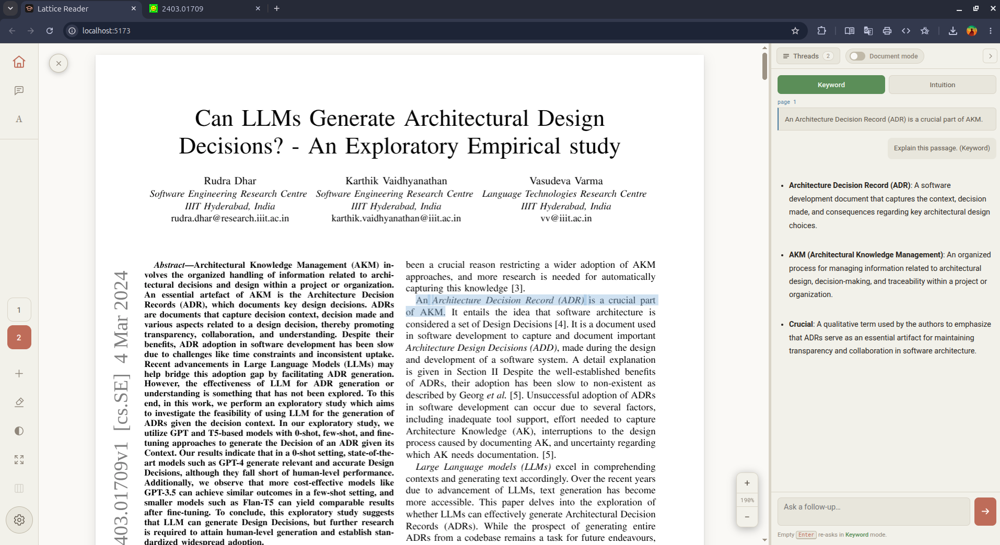

# Lattice Reader
**Ask one thing at a time. How you want it.**

Access the tool at [Lattice Reader](https://pranav-swarup.github.io/lattice-reader/)

Most AI reading tools summarize the whole document and throw it at you. But ideally you want to sit with one paragraph, understand *only that* with context of the whole document.

### Intuition Mode

### Define Mode


---

## Keyboard

| Key | Action |
|---|---|
| `G` | Explain the selected snippet |
| `A` | Annotate the selected snippet |
| `H` | Highlight the selected snippet |
| `Enter` | Send (in a thread) |
| Right-click | Remove a highlight |
| `Ctrl`/`Cmd` + scroll | Zoom the document |
| `Esc` | Close panels / exit focus mode |


---

## Features

### Explanation modes

Select a snippet, then choose the register. Nothing is sent until you hit Enter, so you can switch freely before committing.

| Mode | What it does |
|---|---|
| **Basic** | Restates the snippet in plain English — the same claim, simplest wording that's still true. Analogies, examples, and parallels. |
| **Define** | Pulls out every technical term, symbol, and piece of jargon in the selection and defines each, keeping in mind the document's context. |

Already got an answer and want it re-framed? Switch modes and hit Enter again.

### Invert PDF colors to Dark Mode

- **Invert document** flips the pages to dark while leaving figures and photographs correct. Can be downloaded.
- **Six Reading themes**
- **Focus mode**

### Scoped context

A 30-page paper with 10 pages of appendices is a waste of tokens. Narrowing it can be done with the **Context Pages** option and sharpens answers.

### Threads

Every snippet you ask about becomes its own thread, with full follow-up conversation. You can also ask **a general question** without selecting anything.

### Document mode ⇄ General mode

A switch at the top of the chat pane. In **Document** mode (default) the document is sent as context and answers are grounded in it. Flip to **General** and the document is dropped from the prompt entirely, you get a normal assistant, mid-conversation.

### Highlighting and annotation

- **`H`** highlights the selection. Five muted inks. Right-click any highlight to remove.
- **`A`** annotates the selection. Notes live in a side panel.

### Multi-document library

Documents stack in a rail on the left, each with a **fully isolated session**.

### BYOK - Bring your own API Key

| Provider | Notes |
|---|---|
| **Google Gemini** | **Has a free tier.** No credit card. The default recommended. |
| **Anthropic Claude** | Supports prompt caching — see below. |
| **OpenAI** | GPT-4o. |
| **OpenRouter** | One key, many models. |
| **Ollama** | Fully local, fully free. Localhost only. |

The whole app is static files. Your API Keys are safe!

---

## Getting an API key

The in-app guide (**Settings → How do I get an API key?**) walks through all providers. The short version for the free option:

1. Go to **[aistudio.google.com/apikey](https://aistudio.google.com/apikey)**
2. Sign in with any Google account
3. Click **Create API key**
4. Copy the `KEY98ASASUA8-2………` value into Settings

Free. But generous enough for steady reading. `gemini-3.1-flash-lite` is the default and is the cheapest and fastest option.

---

# For Developers

## Running it

```bash
npm install
npm run dev
```

### Deploying

**GitHub Pages** — push to `main`. The included workflow builds and publishes automatically. One-time setup: **Settings → Pages → Source: GitHub Actions**. Lands at `https://<user>.github.io/<repo>/`.

The workflow sets `VITE_BASE=/<repo>/` so assets resolve under the subpath. Without it every asset 404s and the page renders blank — that's the usual Pages failure. If you attach a custom domain, set `VITE_BASE=/` instead.

**Render / Netlify / Vercel** — static site, `npm ci && npm run build`, publish `dist`. No `VITE_BASE` needed.

> **Note:** Ollama only works when Lattice is served over `http://localhost`. An HTTPS page cannot call a plain-HTTP local server.

---

## Notes on the internals

A few decisions worth knowing if you plan to modify this.

**Prompt caching is the economics.** On Anthropic, the document is sent in the system block with `cache_control: ephemeral`. The first question pays to write the cache; every question after reads it at roughly a tenth of the cost. On a 30k-token paper that's the difference between ~$0.09 and ~$0.01 per question. If you refactor the LLM layer, keep this.

**Text extraction is geometric, not stream-order.** PDF text items arrive in the order they were written to the file, which interleaves the columns of a two-column paper line by line. Lattice reconstructs reading order from the items' x/y coordinates: detect two columns, treat full-width items (title, abstract) as band separators, then read the left column top-to-bottom before the right. Feeding a model column-interleaved text quietly ruins every answer, and it's invisible unless you look.

**The text layer needs `--scale-factor`.** pdf.js v4 positions every glyph in its invisible selectable text layer using `calc(var(--scale-factor) * …)`. If that variable isn't set on an ancestor, the text layer silently misaligns with the painted canvas and selection appears to grab the wrong words. This is the single most important line in the viewer.

**Highlight geometry never touches viewport coordinates.** `range.getClientRects()` returns viewport-space rectangles that shift with scroll and warp under zoom. Instead, Lattice uses the DOM selection only to learn *which* spans and *which character offsets* are selected, and derives geometry from those spans' own `offsetLeft`/`offsetTop` — page-local coordinates that scroll and zoom cannot perturb. Partial spans are sliced proportionally by character count.

**Documents aren't persisted.** localStorage can't hold a PDF. Sessions survive a reload; the file itself must be re-dropped, and a fingerprint (name + size + first-page text) reattaches it to its saved threads.

---

## Known limits

- No server of ours ever sees your key, because there is no server. But anything in browser storage is readable by any script on the page and persists until cleared — true of every bring-your-own-key tool. If using a paid key, use a revocable key with a spend cap (Gemini's free tier needs no billing at all).
- Math renders as inline code, not typeset. No KaTeX yet — it would drop into `Markdown.jsx` in about ten lines.
- Thread reuse is substring-based, not geometric — it won't catch a selection straddling two existing threads.
- Documents with three or more columns fall back to naive extraction.
- A selection dragged across a page boundary highlights only on the first page (the text still captures in full).

---

